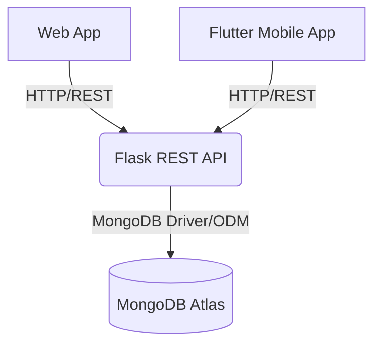

# System Architecture: SecondSpin

## Purpose
To define the technical architecture, technology stack, and integration patterns for the SecondSpin platform.

## Context
The architecture is designed to be clean, maintainable, and understandable. It avoids premature optimization and over-engineering (no microservices, Kubernetes, Redis, or Kafka) while providing a robust foundation that serves multiple clients (Web and Mobile) from a single backend.

## Current Status
Architecture defined.

---

## 1. High-Level Architecture



### Components:
1. **Web Frontend:** Responsive web application providing a browser-based experience.
2. **Flutter Mobile App:** Cross-platform (iOS/Android) mobile application.
3. **Flask REST API:** The single source of truth for business logic, routing, and data processing.
4. **MongoDB Atlas:** Cloud-hosted NoSQL database, ideal for flexible product catalog schemas.

## 2. API Communication
- **Protocol:** HTTP/HTTPS RESTful API.
- **Data Format:** JSON for request/response payloads. `multipart/form-data` for image uploads.
- **Authentication:** JWT (JSON Web Tokens) passed in the `Authorization: Bearer <token>` header.
- **Endpoints:** Resource-oriented routing (e.g., `/api/v1/products`, `/api/v1/users`, `/api/v1/requests`).

## 3. Database Access
- **Database:** MongoDB (via MongoDB Atlas).
- **ODM (Object Document Mapper):** Using a library like `PyMongo` or `MongoEngine` to enforce schema validation at the application level.
- **Collections:** 
  - `users`: Credentials, profiles, roles.
  - `products`: Listings, categories, statuses, image URLs.
  - `requests`: Purchase requests linking buyers, sellers, and products.
  - `reviews`: Ratings and feedback.
  - `reports`: Trust and safety flags.

## 4. Authentication & Security
- **Password Storage:** Passwords will be hashed using `bcrypt` or `Werkzeug.security` before storing in MongoDB. Never stored in plaintext.
- **Session Management:** Stateless JWT tokens with expiration times.
- **Secrets:** All secrets (DB URIs, JWT secret keys, API keys) must be injected via Environment Variables (`.env`). Hard-coding secrets is strictly prohibited.
- **CORS:** Configured on the Flask API to accept requests from the Web frontend domain and Flutter app origins.

## 5. Error Handling
- Standardized API error responses:
  ```json
  {
    "error": "Not Found",
    "message": "Product with ID xyz does not exist.",
    "status_code": 404
  }
  ```
- Graceful degradation on frontends (showing user-friendly error messages rather than raw stack traces).

## 6. Image Handling
- Images will be uploaded to the Flask backend, validated, and stored safely. In the MVP, this may be local storage, scaling later to cloud storage (like AWS S3) with URLs saved in MongoDB.

## 7. Deployment Strategy
- **Backend:** Deployed to a standard hosting provider or PaaS (e.g., Render, PythonAnywhere).
- **Database:** MongoDB Atlas (Serverless or Shared tier).
- **Web App:** Standard static or decoupled hosting (Vercel/Netlify).
- **Mobile App:** Compiled via Flutter.

## Engineering Rules Enforced
1. **Maintainability over Cleverness:** Code must be readable and well-documented.
2. **Single Backend:** Both clients *must* use the exact same API.
3. **Testability:** Business logic decoupled from routing to allow for unit testing.
